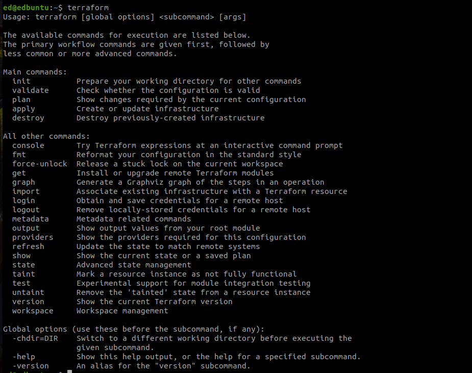
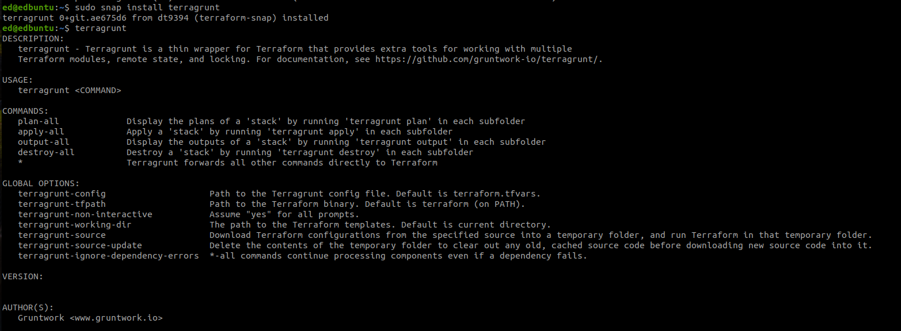
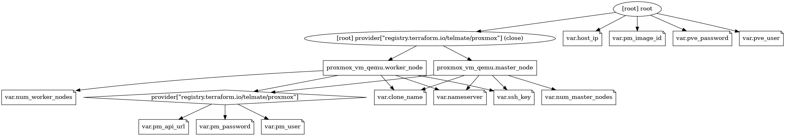

## Needed on Proxmox Host

### Set up Roles and permissions for Proxmox
Instead of running provisioning tasks as root, create a user called 'terraform-prov' who has limited number of roles/permissions within the hypervisor.

Subtitute 'PASSWORD' with your desired password.

```shell
pveum role add TerraformProv -privs "Datastore.AllocateSpace Datastore.Audit Pool.Allocate Sys.Audit Sys.Console Sys.Modify VM.Allocate VM.Audit VM.Clone VM.Config.CDROM VM.Config.Cloudinit VM.Config.CPU VM.Config.Disk VM.Config.HWType VM.Config.Memory VM.Config.Network VM.Config.Options VM.Migrate VM.Monitor VM.PowerMgmt"
pveum user add terraform-prov@pve --password ${PASSWORD}
pveum aclmod / -user terraform-prov@pve -role TerraformProv
```

## Needed on Local workstation running Terraform

## libguestfs-tools (optional)
Tools used for downloading and creating qcow2 images from different OS templates. This one is particularly based on debian-12

```shell
sudo apt-get install libguestfs-tools
```

## AWS CLI
Used for backend state

- https://docs.aws.amazon.com/cli/latest/userguide/getting-started-install.html

```shell
mkdir awsinstaller &&\
cd awsinstaller &&\
curl "https://awscli.amazonaws.com/awscli-exe-linux-x86_64.zip" -o "awscliv2.zip" &&\
unzip awscliv2.zip &&\
sudo ./aws/install
```

## Terraform
Main provisioning tool being used

- https://developer.hashicorp.com/terraform/tutorials/aws-get-started/install-cli
```shell

sudo apt-get update && sudo apt-get install -y gnupg software-properties-common &&\
wget -O- https://apt.releases.hashicorp.com/gpg | \
gpg --dearmor | \
sudo tee /usr/share/keyrings/hashicorp-archive-keyring.gpg &&\

echo "deb [signed-by=/usr/share/keyrings/hashicorp-archive-keyring.gpg] \
https://apt.releases.hashicorp.com $(lsb_release -cs) main" | \
sudo tee /etc/apt/sources.list.d/hashicorp.list &&\

sudo apt update &&\

sudo apt-get install terraform
```
   


## Terragrunt
- https://terragrunt.gruntwork.io/docs/getting-started/install/
```shell
sudo snap install terragrunt
```
   

## Graphviz 
To Vizualize the plan's graph:

1. Install GraphViz if not installed:
```shell
sudo apt install graphviz
```
2. Run graph command:
```shell
terraform graph -type=plan | dot -Tpng > plan_graph.png
```

   

## Tenable Terrascan
+ https://runterrascan.io/docs/getting-started/#installing-terrascan

```shell
$ curl -L "$(curl -s https://api.github.com/repos/tenable/terrascan/releases/latest | grep -o -E "https://.+?_Darwin_x86_64.tar.gz")" > terrascan.tar.gz
$ tar -xf terrascan.tar.gz terrascan && rm terrascan.tar.gz
$ install terrascan /usr/local/bin && rm terrascan
$ terrascan
```

## Hashicorp Vault (optional)
You can use AWS KMS instead of a locally-hosted Vault server

```shell
sudo apt update && sudo apt install gpg && sudo install vault
```