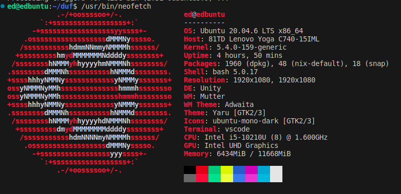
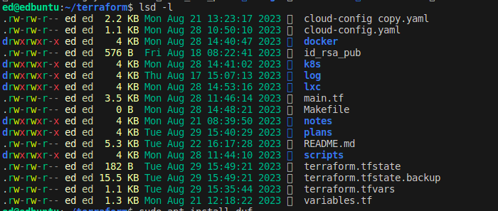
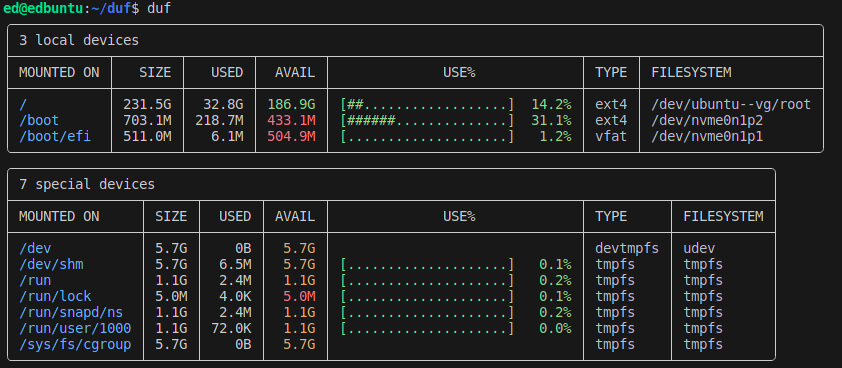

## Standard Installed Items:
All below get installed at a minimum for every deployment

### 1.  apt-transport-https

Allows the use of repositories accessed over HTTPS

- https://manpages.ubuntu.com/manpages/focal/en/man1/apt-transport-https.1.html

### 2.  gnupg

- https://www.gnupg.org/

### 3. libguestfs-tools

Set of tools for accessing and modifying virtual machine (VM) disk images.

- https://www.libguestfs.org/

### 4. qemu-guest-agent

Daemon intended to be run within virtual machines. It allows the hypervisor host to perform various operations in the guest.

- https://qemu-project.gitlab.io/qemu/interop/qemu-ga.html

### 5. neofetch

Displays information about your operating system, software and hardware in an aesthetic and visually pleasing way.

- https://github.com/dylanaraps/neofetch

   

### 6. lsd (ls Deluxe)

Provides a beautifully styled output with little icons and a very helpful color palette.

- https://github.com/lsd-rs/lsd

   

### 7. duf

Disk Usage/Free Utility (Linux, BSD, macOS & Windows).

- https://github.com/muesli/duf 
- https://idroot.us/install-duf-ubuntu-20-04/

   